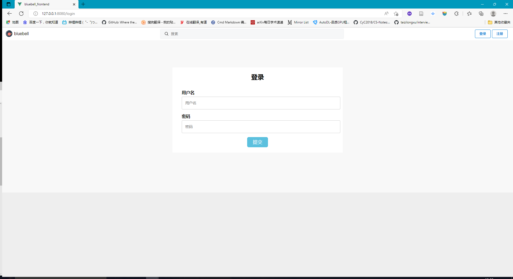
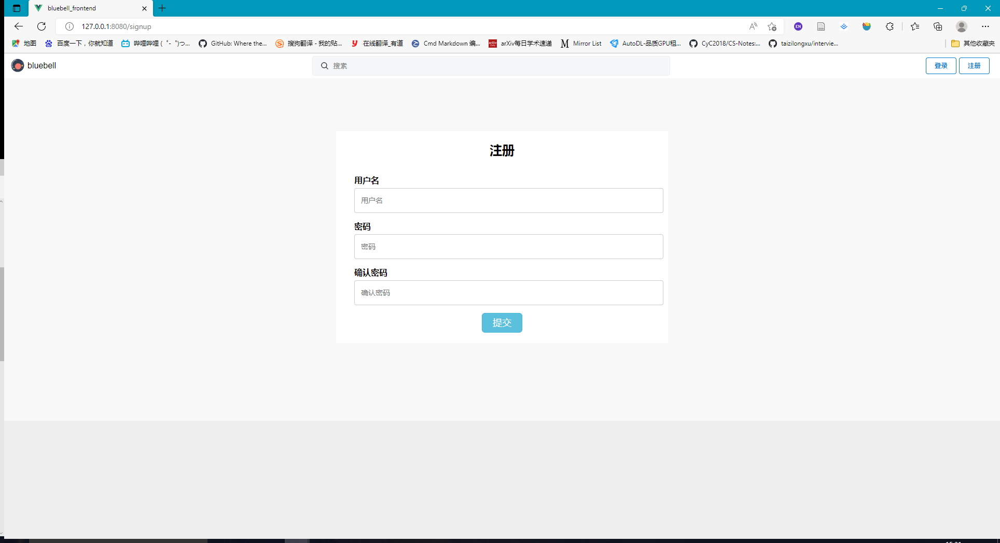
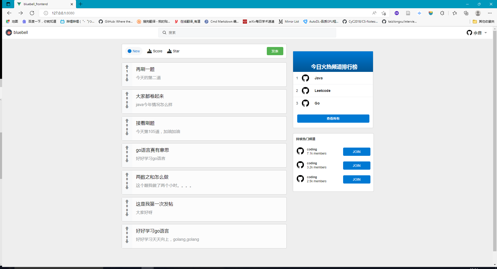
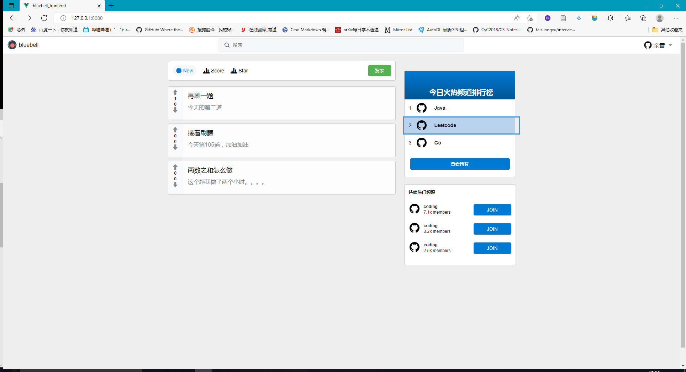
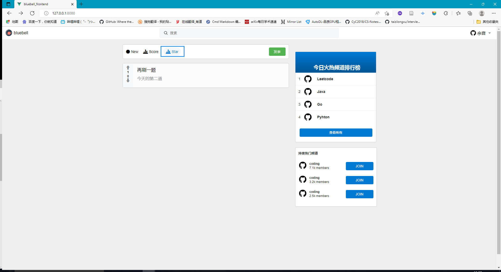

# bluebell
帖子后端项目

## 项目介绍
- bluebell是一个仿reddit的社区帖子项目
- 基于gin框架和Vue框架搭建的前后端分离的web项目

## 项目技能

- gin框架
- viper配置管理
- JWT认证
- Zap日志库
- Go语言操作Mysql
- Go语言操作Redis

## Docker部署步骤
1. 在Docker容器中启动mysql和redis服务，容器分别为：mysql redis
  - 启动redis：``` docker run -itd -p 6379:6379 --name redis -v /conf/redis.conf:/etc/redis/redis.conf -v /data/redis/:/data redis redis-server /etc/redis/redis.conf ```
  - 启动mysql:``` docker run --name mysql -p 3306:3306 -e MYSQL_ROOT_PASSWORD=123456 -v /data/mysql:/mysql -d mysql:5.7 ```
2. 修改配置文件中的内容:
  - app-host : 0.0.0.0
  - mysql-host: mysql(mysql容器名)
  - redis-host: redis(redis容器名)
3. 在docker中部署：
  - ``` docker build . -t bluebell_app ```
  - ``` docker run --link=mysql --link=redis -p 9000:8888 bluebell_app ```

## 项目预览
- 主页面

- 登录 注册


- 帖子列表
全部帖子：

按照社区分类：

赞过的帖子：

